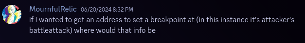

# Search

So you've checked out the decomp, and you're getting settled to implement your
slick new feature. The dreaded question comes to mind: *Where do I start?*

If this were a research project in university, I'd generally start by Googling
some keywords, and the same principle applies here. Instead of using a
general-purpose search engine, however, we're going to search the repo itself
for code containing specific words.

There are a few different tools for this -- the search bar in Windows File
Explorer or on Github will work, but I strongly recommend getting used to some
kind of regular-expression based tool. The screenshots in this post will be
showing [ripgrep (rg)](https://github.com/BurntSushi/ripgrep), a command-line
based modern replacement for the original
[grep](https://www.gnu.org/software/grep/manual/grep.html), which comes with
many Linux-for-Windows distributions, notably MinGW, WSL and git bash. For a
GUI-based tool, you can check out
[grepWin](https://github.com/stefankueng/grepWin), which is actively maintained
and has good reviews, though I have never used it myself. If you're not familiar
with regular expressions, there is no shortage of resources on the internet. I
recommend [RegexOne](https://regexone.com/) myself.

The basic gameplan I recommend is to search for keywords until you find
something that looks like it's related to whatever it is you're trying to do.
Then, you'll have to roll up your sleeves and actually read some of the code. If
your question is answered, great! Otherwise, the code you just read will
hopefully have given you something else to look for. In the most straightforward
case (more often than you might think, and probably a good starting point if
you're completely lost), you might directly know the name of the next thing
you're looking for (for example, if you're reading function A which calls
function B, it might be a good idea to look at the definition of function B!).
Other times, you might have to make do with a little less -- maybe you learned
some new terminology you hadn't thought of, or you learned the name of a global
variable that's related to what you're doing. Eventually, you'll settle on the
answer you're looking for.

Of course, I recognize that the above paragraph is more than a little vague, and
way easier said than done. Knowing what words to search for (and guessing which
results might be useful) is more of an art than a science, and the closest
things to hard rules require you to have some background knowledge about what
things are called internally. Some basic tips that I've found useful, however:

- The grep-based tools I recommended earlier are case-sensitive by default
  (meaning `Stat` and `stat` are counted differently). This can be annoying if
  you don't know the exact capitalization, but it can help separate function
  names from parameters and locals.

- Keyword searching is both good to learn the names of important parts of code
  *and* to find where specific functions (or structs, etc) are actually used.

  If you don't know the name of a specific function, it's likely easier to
  search in header files only, and on the flip side, you should limit your
  search to source (`.c`) files if you're looking for how a function is used.
  A function defined in `foo.h` is usually (but not always!) found in `foo.c`.

- Try to search for things that you think will have *fewer* hits (but not
  zero!) rather than maximize coverage. It will help you narrow down to
  "useful-looking" code much faster, and it'll be easier to filter out code
  that definitely isn't relevant. If you're not sure, when in doubt, searching
  for longer words will give you fewer results.

- In many cases, seeing how/where a name is *used* is more important than its
  direct definition. For example, I didn't really need to know that
  `sMusicProc1` is a `Proc*`, but knowing where this variable gets *assigned
  to* is probably *very* important. This is where using a regex tool comes in
  handy -- I could search *specifically* for `sMusicProc1 =`, instead of just
  all occurrences of `sMusicProc1`.

   (Image: finding
  all assignments to a specific variable)

- Some functions have non-descriptive names, like `sub_8084B98`. My heuristic
  is to ignore these for as long as possible, only really digging in if it's
  directly called by something relevant, or if it uses a global that I'm
  interested in.

- **It will take multiple tries.** Be persistent; your first guess will
  usually be wrong. In these cases, try different capitalizations, synonyms
  for the same words, etc. The decomp *mostly* uses similar terminology to
  other tools, which can help narrow down the exact phrasing.

More commonly, you'll search something so general that there are *way* too
many results to be useful. I don't know about you, but I do not have the
patience to sift through every occurrence of the word "battle" (by my count,
973 just in files ending with `.c`). In these cases, I usually look at the
first few results and see if the filename looks useful. If not, back to the
drawing board.

[details=Case Study 1: Where to stat]

(Image text: "Where is the statscreen's hit value calculated, and can I insert
code to edit that value similarly to doing so in the pre-battle loop?")

Our first exploration will be a "where does the number on my screen come
from"-type question. In my experience, these questions are both very common and
pretty easy, so perfect for getting your feet wet.

Here, we're looking for the intersection of two systems ("calculating hit" and
"displaying on the statscreen"), so that suggests two places to begin searching:

-   Look for code that computes hit in general, then find where the statscreen
    calls it?
-   Look for code that draws the statscreen, then figure out where it fetches
    hit from?

In keeping with "start with the more specific word", `statscreen` is a pretty
specific word, whereas `hit` could be used to mean something other than
"accuracy". Also, `statscreen` is 10 letters and `hit` is 3 letters. So we're
going to search for `statscreen` first.

 (Image: Searching
for "statscreen")

Not pictured: Like, 20 more `#include "statscreen.h"` results.

With all of these, it's a pretty good bet that `statscreen.c` exists
(alternatively, you could see the `statscreen.o` is in `ldscript.txt`, meaning
that `src/statscreen.c` definitely exists). Taking a peek at that file in my
editor, I see that it's pretty complicated and there's no chance that I'm going
to understand the entire thing at once. Luckily, while the statscreen does a lot
of things, most of them are probably not computing the unit's hitrate (citation
needed), so I can safely ignore anything that doesn't seem to relate to hitrate.

Searching this file now for `Hit`, we get four different results (this is where
case-sensitive search comes in handy -- when I just press Ctrl-F for "hit" on
the github webpage, there are over 20 results!):

- The first result is `gMid_Hit`, on [line 61](https://github.com/FireEmblemUniverse/fireemblem8u/blob/451cbcd3422bafee61cbced95c15fa78aac14ff8/src/statscreen.c#L61):
  This is a good start, but it's part of some big complicated struct that I
  don't understand. It is next to something with the word `LABEL` in it, so
  maybe this is related to the literal text `Hit` on the statscreen. I still
  don't know if this draws that entire section, or just the word `Hit`.

- Searching further for `gMid_Hit`, the only other result is `gMid_Hit` and
  the word `Hit` on [line 2875](https://github.com/FireEmblemUniverse/fireemblem8u/blob/451cbcd3422bafee61cbced95c15fa78aac14ff8/src/statscreen.c#L2875).
  This is some unknown magic number, but I'll make an educated guess that
  `Mid` is actually `Message ID`, not just an evaluation of my code quality.
  And indeed, text ID 0x4F4 is the text `Hit`. This means that the entry in
  the large data structure above is probably *just* for the label.

- If that data structure above draws the label, then the function that uses it
  is probably the same function that actually fetches the value. Searching for
  `sPage1TextInfo` (the name of the struct containing `gMid_Hit` earlier)
  takes us to the function [`DisplayPage1`](https://github.com/FireEmblemUniverse/fireemblem8u/blob/451cbcd3422bafee61cbced95c15fa78aac14ff8/src/statscreen.c#L717).

- At this point, I don't think I have much more of a choice but to skim the
  function. A few lines below, we have `GetUnitEquippedWeaponSlot`, which
  suggests that we're on the right track. And indeed, just a bit below that,
  jackpot: on [line 766](https://github.com/FireEmblemUniverse/fireemblem8u/blob/451cbcd3422bafee61cbced95c15fa78aac14ff8/src/statscreen.c#L2875),
  `gBattleActor.battleHitRate`.

The next step is to figure out what function actually populates the struct
member `gBattleActor.battleHitRate`, This is bad, because `gBattleActor` isn't
referenced in `statscreen.c` beyond this one function, and `gBattleActor` sounds
like a variable that is used in a lot of places that I don't want to have to dig
through (if you were following this conversation on discord, you'd have seen
that I got stuck here). You could call it a day and simply fire up no$gba and
set a breakpoint on `gBattleActor.battleHitRate`, but I find that unsatisfying.

Going back to the call to `GetUnitEquippedWeaponSlot` above, we notice that the
first parameter is `gStatScreen.unit`. That's interesting, I wonder where else
`gStatScreen.unit` is used...

Searching for that term brings us to a call to `BattleGenerateUiStats` on [line
409](https://github.com/FireEmblemUniverse/fireemblem8u/blob/451cbcd3422bafee61cbced95c15fa78aac14ff8/src/statscreen.c#L409).
Aha! This seems like exactly what we're looking for! Going to the definition of
that function (searching for `BattleGenerateUiStats` in header files takes us to
`bmbattle.h`, so look in `src/bmbattle.c`), the only place `battleHitRate` is
assigned is [line
238](https://github.com/FireEmblemUniverse/fireemblem8u/blob/451cbcd3422bafee61cbced95c15fa78aac14ff8/src/bmbattle.c#L238),
where it's set to the constant 0xFF (= -1). That probably means that the value
is populated earlier in the function, like in the suggestively-named
[`ComputeBattleUnitStats`](https://github.com/FireEmblemUniverse/fireemblem8u/blob/451cbcd3422bafee61cbced95c15fa78aac14ff8/src/bmbattle.c#L227)
a few lines earlier.

Finally, that function calls
[ComputeBattleUnitHitRate](https://github.com/FireEmblemUniverse/fireemblem8u/blob/451cbcd3422bafee61cbced95c15fa78aac14ff8/src/bmbattle.c#L478),
which sure sounds like the end of our quest.

## Reflection

Hopefully by now, you should have a pretty good idea of my thought process when
trying to look through code.

Note that the precise process outlined here was actually quite roundabout:

- We could have skipped reading through `DisplayPage1` simply by giving up on
  `gMid_Hit` and continuing to search for the word `Hit`, which would have
  brought us to the use of `battleHitRate`.
- If I'd then thought to search for `battleHitRate =`, we would have found
  `ComputeBattleUnitHitRate` right away.

We instead went through the painstaking process of running around through all
these different functions because that was the *actual path I took* when
searching for the answer to this question. Even I, someone confident enough to
have wriiten this guide, don't necessarily know ahead of time which paths are
dead ends or not. The reality is, navigating a large codebase requires trial and
error, backtracking, and leaps of faith.
[/details]

[details=Case Study 2: Taking a break]

(Image text: "If I wanted to get an address to get a breakpoint at (in this
instance, it's attacker's battleattack) where would that info be?")

In this case, we're less interested in finding the source of a value, but the
RAM location of a value itself. While this is exactly the kind of information
that FEbuilder might have on-hand, let's see if we can find it for ourselves.

Immediately grepping for `attacker` gets... many hits. That doesn't seem like a
good idea. As a wild guess, let's try `Attacker`, and see if we can hit on a
useful variable name.

<!---->
(Image: Only a few hits for capital-A "Attacker")
[/details]

[details=Case Study 3: A smile would be nice]

(Image text, paraphrased: "The portrait displayed for the equip/item/trade/etc
menu always uses the non-smiling closed-mouth frame. Is there some way to change
it to either use the statscreen mouth frame, or no mouth frame at all?")
[/details]
